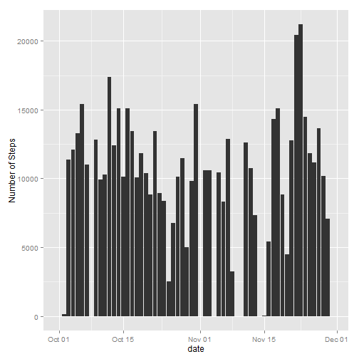
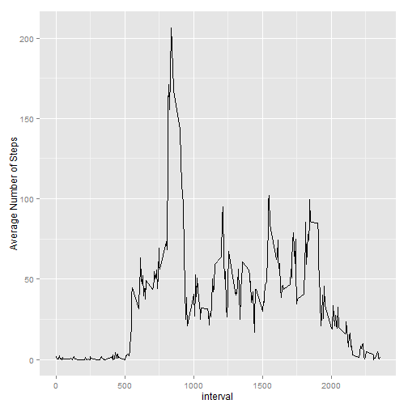
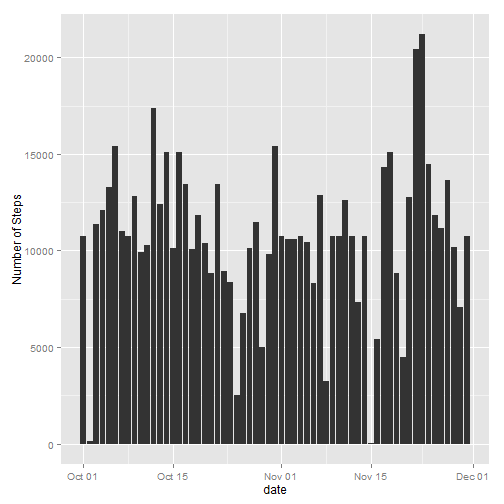
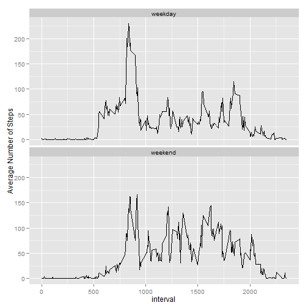

## Loading and preprocessing the data

```r
library(ggplot2)
```

```
## Warning: package 'ggplot2' was built under R version 3.1.3
```

```r
library(dplyr)
```

```
## Warning: package 'dplyr' was built under R version 3.1.3
```

```
## 
## Attaching package: 'dplyr'
## 
## The following object is masked from 'package:stats':
## 
##     filter
## 
## The following objects are masked from 'package:base':
## 
##     intersect, setdiff, setequal, union
```

```r
dat = read.csv("activity.csv")
dat$date = as.Date(x = dat$date, format = "%Y-%m-%d")
dat = as.tbl(dat)
```


## What is mean total number of steps taken per day?
1) A histogram of the total number of steps taken each day

```r
tmp = group_by(dat, date) %>% summarise(total = sum(steps, na.rm = T))
ggplot(tmp, aes(x = date, y = total)) + geom_histogram(stat = "identity") + 
    ylab("Number of Steps")
```

 

```r

StepMean = mean(tmp$total, na.rm = T)
StepMedian = median(tmp$total)
```


2) The mean of the total number of steps per day is 9354.2295 and the median is 10395

## What is the average daily activity pattern?
1) Time series plot of the average number of steps per interval

```r
AvgStepPerInterval = group_by(dat, interval) %>% summarise(total = mean(steps, 
    na.rm = T))
ggplot(AvgStepPerInterval, aes(x = interval, y = total)) + geom_line() + ylab("Average Number of Steps")
```

 

```r
MaxInterval = AvgStepPerInterval[which.max(AvgStepPerInterval$total), 1]
```

2) The interval with the maximum average number of steps is 835

## Imputing missing values

1) Missing values

```r
NumMissingValues = sum(is.na(dat$steps))
```

Number of missing values is 2304

2,3) Used the mean of the 5-minute interval (rounded) to fill missing values, and create a new dataset

```r
ImputedDat = inner_join(dat, AvgStepPerInterval, "interval")
ImputedDat[is.na(ImputedDat$steps), 1] = round(ImputedDat[is.na(ImputedDat$steps), 
    4])
ImputedDat = select(ImputedDat, -total)
```


4) A histogram of the total number of steps taken each day and Calculate and report the mean and median total number of steps taken per day

```r
tmp = group_by(ImputedDat, date) %>% summarise(total = sum(steps, na.rm = T))
ggplot(tmp, aes(x = date, y = total)) + geom_histogram(stat = "identity") + 
    ylab("Number of Steps")
```

 

```r

StepMeanImputed = mean(tmp$total)
StepMedianImputed = median(tmp$total)
```


The mean of the total number of steps per day using the imputed data is 1.0766 &times; 10<sup>4</sup> and the median is 1.0762 &times; 10<sup>4</sup>

The mean using the imputed data is much bigger than using the original data (a difference of 1411.4098)

The median is also different by 367. Note that the median increased because most of the missing values are at earlier dates. 

## Are there differences in activity patterns between weekdays and weekends?
1- Adding a new factor indicating whether a given date is a weekday or weekend

```r
weekends = weekdays(ImputedDat$date, abbreviate = TRUE) %in% c("Sun", "Sat")
ImputedDat = mutate(ImputedDat, DateType = "weekday")
ImputedDat$DateType[weekends] = "weekend"
```


2-Compare the average number of steps during weekends and weekdays

```r
tmp = group_by(ImputedDat, interval, DateType) %>% summarise(total = mean(steps, 
    na.rm = T))
ggplot(tmp, aes(x = interval, y = total)) + geom_line() + ylab("Average Number of Steps") + 
    facet_wrap(~DateType, ncol = 1)
```

 

